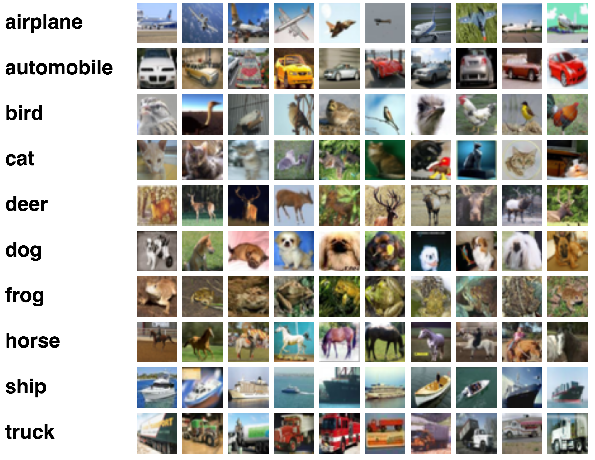
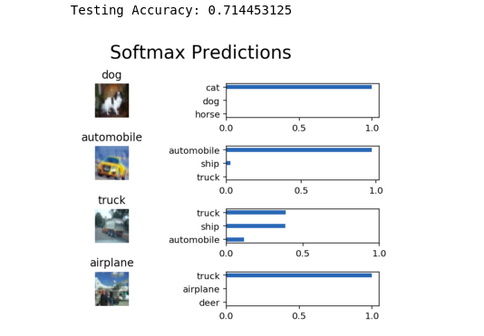

# Image-Classifier

## Cifar10 Image Classification Project.
In this project, we classify images from the [CIFAR-10](https://www.cs.toronto.edu/~kriz/cifar.html) dataset. The dataset consists of airplanes, dogs, cats, and other objects. Here, we preprocessed the data, then train a convolutional neural network on all the samples. We normalize the images, one-hot encode the labels, build a convolutional layer, max pool layer, and fully connected layer. At then end, we inspect their predictions on the sample images.

## Software Requirements

  1.Install [Anaconda](https://www.anaconda.com/download/#linux) 
  
  2.Download or clone this github repository 
  
  3.Launch jupyter notebok within the file containing `image_classification.iypynb` file
  
  4.Run the cells to train and execute the model. 
  
## Cifar Data Set
  It contains images of the various objects and goal of the model is to identify the objects from this data set
  
  
 ## Final Result
  
  
